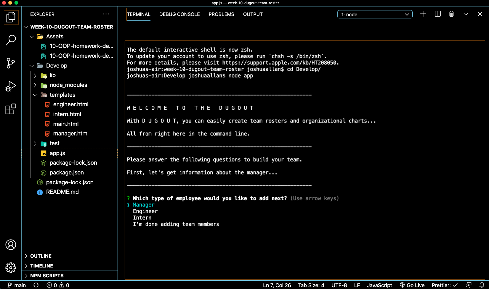
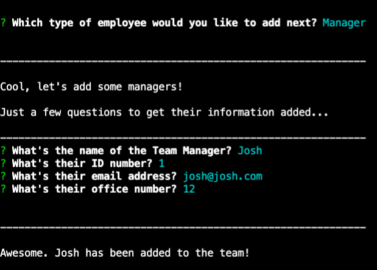
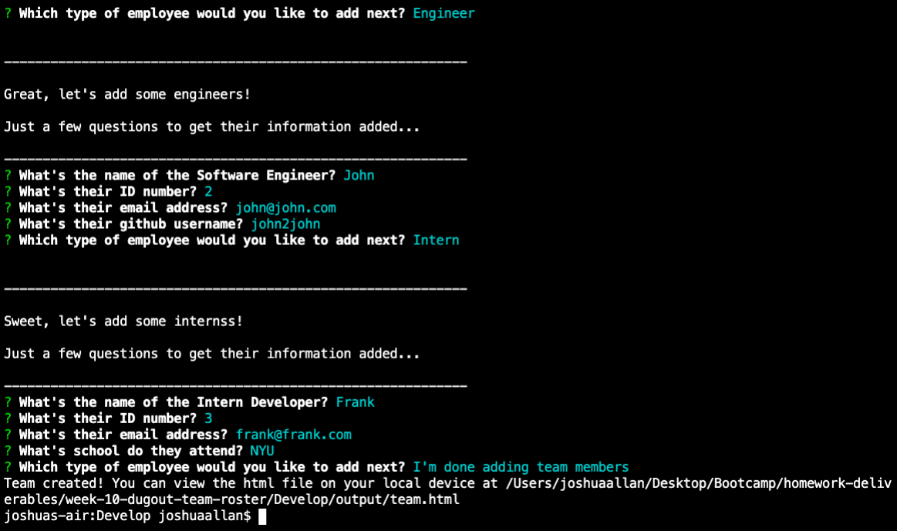
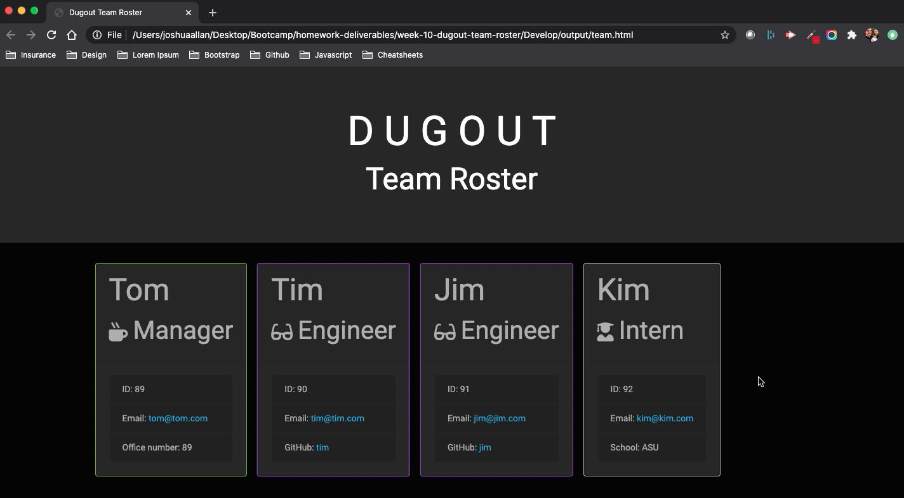
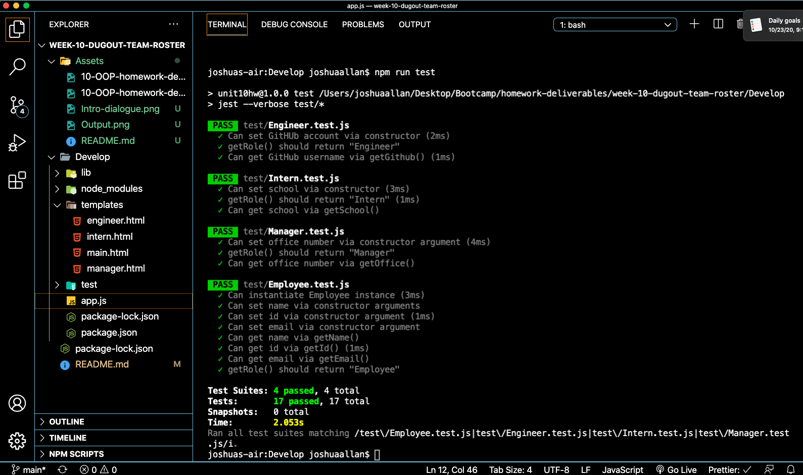

# **D U G O U T**

---

## **Description**

D U G O U T allows you to build team rosters...all from the command line. It intakes data, and outputs an HTML file for you to quickly and easily view your team's structure.

---

## **Table of Contents**

1. [Installation](#Installation)
2. [Usage](#Usage)
3. [License](#License)
4. [Contributions](#Contributions)
5. [Tests](#Tests)
6. [Questions](#Questions)
7. [Author](#Author)
8. [Screenshots](#Screenshots)
9. [Video](#Video)

---

## **Installation**

1. Clone the repo: `git clone https://github.com/jallan07/dugout-team-roster-generator.git`
2. Install NPM packages: `npm i`

   ***

## **Usage**

N/A

---

## **License**

Distributed under the MIT License.

---

## **Contributions**

**Current Contributors:**

_Josh Allan_

Contributions are what make the open source community such an amazing place to be learn, inspire, and create. Any contributions you make are greatly appreciated.

1. Fork the Project
2. Create your Feature Branch (git checkout -b feature/AmazingFeature)
3. Commit your Changes (git commit -m 'Add some AmazingFeature')
4. Push to the Branch (git push origin feature/AmazingFeature)
5. Open a Pull Request

   ***

## **Tests**

This application has been tested in a countless number of different environments to ensure peak performance. However, bugs may exist, especially when used in combination with additional packages. Please be sure to test the application after an initial download.

To test run the code after installing on your local device, use the following code:
`npm run test`

---

## **Questions**

The following questions exist on our end, and are currently trying to be solved:

N/A

---

## **Author**

Below is contact information for the author of this application. Please feel free to reach out directly if additional questions exist.

- Name: Josh Allan
- Email: allan.josh07@gmail.com
- LinkedIn: https://www.linkedin.com/in/joshuamallan/

---

## **Screenshots**

---

## **Video**

[View the walkthrough video on YouTube](https://youtu.be/5xGNer8ZbFc)

---

### Thank you for using D U G O U T!
