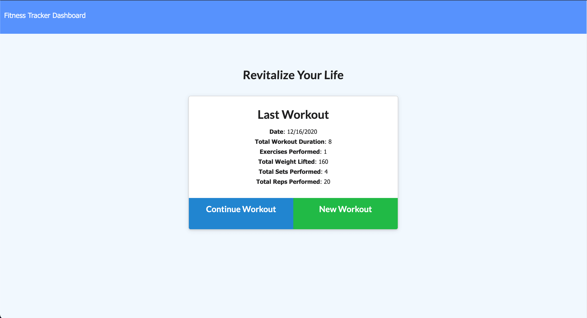
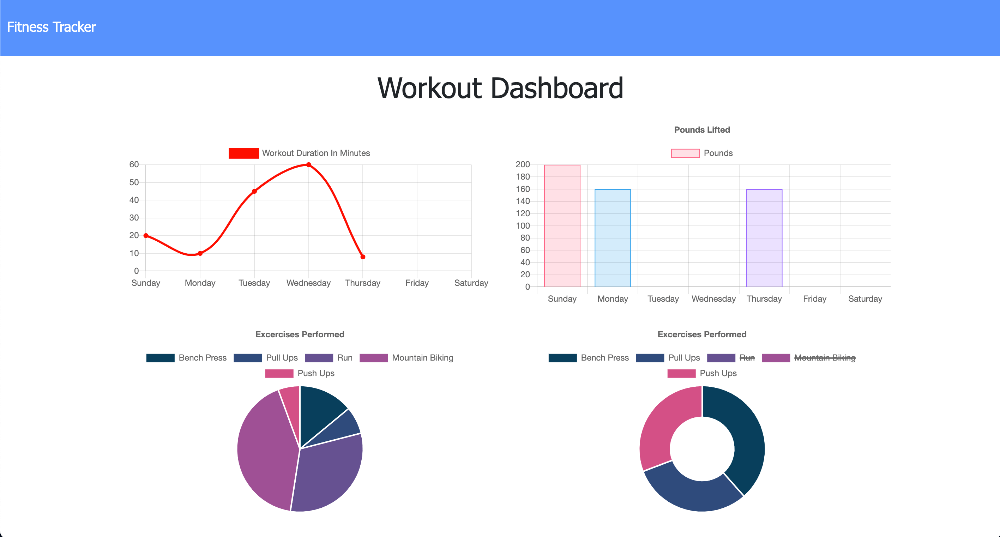
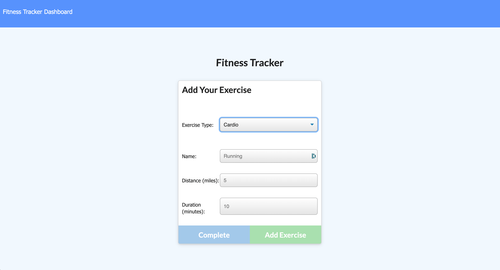

# **Revitalize Health | Fitness Tracker & Health Dashboard**

---

## **Description**

With Revitalize Health, you can easily track your workouts throughout the week. Revitalize utilizes MongoDB to record and store your workout data, and displays that data in a simple, easy-to-read view. Revitalize your life today with Revitalize Health!

---

## **Table of Contents**

1. [Technologies](#Technologies)
2. [Installation](#Installation)
3. [License](#License)
4. [Contributions](#Contributions)
5. [Author](#Author)
6. [Screenshots](#Screenshots)

---

## **Technologies**

- MongoDB
- Heroku
- .env Environment Variabls
- HTML/CSS
- Javascript
- Compression NPM Package

---

## **Installation**

1. Clone the repo: `git clone https://github.com/jallan07/fitness-app.git`
2. Install NPM packages: `npm i`

---

## **License**

Distributed under the MIT License.

---

## **Contributions**

**Current Contributors:**

_Josh Allan_

Contributions are what make the open source community such an amazing place to be learn, inspire, and create. Any contributions you make are greatly appreciated.

1. Fork the Project
2. Create your Feature Branch (git checkout -b feature/AmazingFeature)
3. Commit your Changes (git commit -m 'Add some AmazingFeature')
4. Push to the Branch (git push origin feature/AmazingFeature)
5. Open a Pull Request

---

## **Author**

Below is contact information for the author of this application. Please feel free to reach out directly if additional questions exist.

- Name: Josh Allan
- Email: allan.josh07@gmail.com
- LinkedIn: https://www.linkedin.com/in/joshuamallan/

---

## **Screenshots**

---

### Thank you for using Revitalize Health | Fitness Tracker & Health Dashboard!
